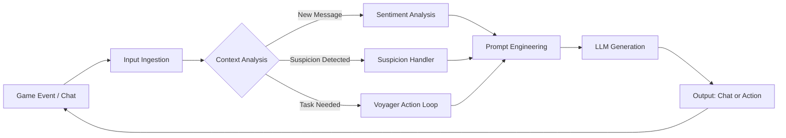

---

# Artificial Social Environments

We built a "Truman Show" style simulation in Minecraft where a single human player is immersed in a world populated entirely by AI agents. Using a modified version of Voyager and MineDojo, we turned a standard Survival Multiplayer (SMP) server into a controlled social experiment. The agents don't just survive; they have personas, they chat, they react to game events, and they actively try to deflect suspicion if you accuse them of being bots.

## Inspiration

The core inspiration for this project comes from the philosophical terror of *The Truman Show* and the "Dead Internet Theory." I have always been fascinated by the idea of solipsism in digital spaces. When you play an MMORPG, how do you *know* the Healer behind you is a person? Is it because they made a typo? Is it because they jumped continuously for no reason?

I wanted to test the limits of this skepticism. With the rise of Generative Agents (like the famous [Stanford "Smallville" paper](https://arxiv.org/abs/2304.03442)), we've seen agents that can simulate daily life in 2D. But 2D top-down simulations abstract away the messy, visceral reality of a 3D world. I wanted to see if that same social illusion could hold up in *Minecraft*: a game where physics, combat, and spatial awareness are critical.

  
    

    Diagram from Stanford's paper
        

## Overview

**Artificial Social Environments** investigates the boundary between human and artificial sociality. By placing a human in a server where every "other player" is actually an LLM-driven agent, we measure how long the illusion holds. The project combines embodied AI (agents that can navigate, mine, and build) with a social behavior layer (agents that can banter, empathize, and lie). The goal is to see if subtle behavioral cues (like typing "rip" when you die or complaining about server lag) are enough to convince a human that they are in the company of others.

## Proposal

I propose **Truman Agents**:

A system that bridges high-level social reasoning with low-level game mechanics. The pipeline ingests the game state (inventory, location, chat logs) and passes it to an LLM which decides whether to act (mine/build) or speak. We implement specific modules for **Emotional Mimicry** (matching the vibe of the chat) and **Suspicion Handling** (strategies to use when a human asks "Are you a bot?").

We ran a pilot study with 10 participants to see if they could sniff out the simulation. We found that while technical glitches often gave it away, social engineering worked surprisingly well.

When we started this project, we leaned heavily on the **Voyager** library. Voyager is incredible at playing Minecraft, it can craft diamond pickaxes and beat the game. However, we quickly realized that Voyager is a **sociopath**.

In our early tests, the Voyager agents were hyper-efficient. If you said "Hello," they would ignore you and continue mining iron because their utility function prioritized resource acquisition. They moved like machines: perfect pathfinding, zero hesitation, zero "wasted" movement. It was immediately obvious they were bots.

We had to pivot from optimizing for *competence* to optimizing for *vibes*. We had to make the agents worse at the game to make them better at the simulation. We introduced "Social Interrupts", signals that force the agent to stop its physical task (mining) to attend to a social task (chatting). We also had to solve the "Statue Problem," where agents would freeze for 5-10 seconds while the LLM was thinking. To fix this, we implemented "Idling Micro-Behaviors", if the LLM is processing a response, the agent doesn't stand still; it moves around, shuffles inventory, looks around, or jumps, masking the latency as human fidgeting.

Below is the interaction workflow for the agents:

Here is our system overview:

## Components

The system relies on a seamless loop between the Java Minecraft server and the Python agent backend.

### 1. The Server Plugin (The Eyes)
We wrote a custom Java plugin for the PaperMC server. This plugin acts as the omniscient observer. It doesn't just log chat; it logs *context*. It detects when players are within 10 blocks of each other (proximity), it detects when a player takes damage, and it detects "Global Events" like the sun setting or a thunderstorm starting. This data is streamed via WebSocket to the Python controller.

### 2. The Social Behavior Layer (The Brain)
This is where the magic happens. We couldn't just feed raw game logs to GPT-4; the context window would explode, and the cost would be astronomical. We built a **Context Manager** that curates the prompt based on relevance.

The prompt structure includes:
* **Persona:** "You are 'Steve'. You are cautious and hate caves. You type in lowercase."
* **Short-term Memory:** The last 10 chat lines.
* **Visual Context:** "You see [PlayerName] holding a Diamond Sword."

### 3. Suspicion Handling
This was our defense mechanism. We used keyword detection for phrases like "bot," "AI," "NPC," or "are you real." When triggered, the agent swaps to a defensive prompt strategy. We found that denial ("I am not a bot") is unconvincing. Instead, we used:
* **Self-Deprecating Humor:** "I wish I was a bot, then I wouldn't have to mine this cobble."
* **Technical Blaming:** "Sorry, playing on a trackpad right now."
* **Gaslighting:** "Bro why are you acting so weird?"

Below are some screenshots of the agents navigating and performing tasks:

<table>
  <tr>
    <td>
        
        </td>
    <td>
    
        </td>
  </tr>
    <tr>
    <td>

        </td>
    <td>

        </td>
  </tr>
</table>

Below is a video overview of the project:

https://youtu.be/2fo92JIPLIU

## Results

We ran 10 sessions, each lasting about 30 minutes. The data showed that humans are surprisingly easily socially engineered in this context, but the technical "body language" of the agents remains a dead giveaway.

**Detection Rates:**
* Only **2 out of 10** participants correctly identified that *every* other player was an AI.
* **6 out of 10** believed they were in a mixed server (some humans, some bots).
* **2 out of 10** were fully deceived, believing everyone was human.

When we asked participants to label specific avatars after the game, they mislabeled **68%** of the AI agents as "Human." This suggests that even when players suspected *something* was off, they couldn't pinpoint *who* was off.

**Suspicion Dynamics:**
Suspicion usually kicked in around the **14-minute mark**. It wasn't the chat that broke the illusion - it was the movement.
* **Repetitive Phrasing:** Identical sentence structures or overly formal language broke immersion.
* **Pathfinding Artifacts:** Agents getting stuck on blocks or moving erratically caused skepticism.
* **Reaction Time:** Delays in combat support or conversation made agents feel 'laggy'.

However, the **Suspicion Handler** triggered 22 times across the sessions. In 15 of those cases, the human player dropped the accusation after the agent made a joke or complained about lag. We essentially successfully gaslit the players into thinking the agents were just awkward humans.

<table width="100%">
  <tr>
    <td width="50%" align="center">
      
    </td>
    <td width="50%" align="center">
      
    </td>
  </tr>
</table>

## Discussion

| Participant Type | Feedback |
|---|---|
| **The Believer** | "MajesticSwift felt like a real dude who just likes building and vibing." This participant interpreted the agent's singular focus on building not as a personality trait of a chill human player. |
| **The Skeptic** | "Some replies felt like ChatGPT but in Minecraft." This participant noticed the specific cadence of LLM text generation - slightly too polished, slightly too helpful. |
| **The Social Player** | Rated "Social Environment" a 4.3/5. Even though the environment was fake, they felt they were part of a group. The mere presence of entities that acknowledge your existence creates a "social presence" that overrides the knowledge of artificiality. |

The "Truman Show" experiment reveals that social presence is not binary. It is a gradient built on small, reciprocal gestures. A robot that mines diamond is a tool; a robot that mines diamond and says "finally!" is a teammate.

The agents succeeded not because they were perfect, but because they provided just enough "social noise" to cover their mechanical flaws. When an agent gets stuck on a block, it looks like a glitch. When an agent gets stuck on a block and types "lag," it looks like a human. This implies that as we move toward the Metaverse and more integrated digital spaces, the "Turing Test" will not be a formal interrogation, but a continuous, ambient evaluation of social plausibility. We are entering an era where loneliness in digital spaces can be solved by simulation, raising the question: does it matter if your friends are real, as long as the camaraderie feels true?

## Special Thanks

This project would not have been possible without the guidance of **Wendy Ju**, who encouraged me to look past the technical implementation of agents and focus on the *social* implications of their presence. A huge thank you to **Jiayu Zhang**, my co-author, who contributed to the study design and the preparation of the manuscript.

I also want to thank **Bil Leon** for his invaluable mentorship on experimental design and **Deborah Estrin** for her support in the early conceptual phases. Finally, thanks to the 10 anonymous participants who unknowingly let us Truman Show them for science.
